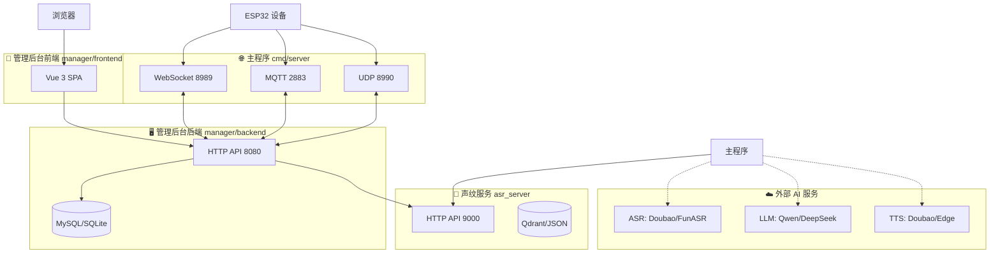
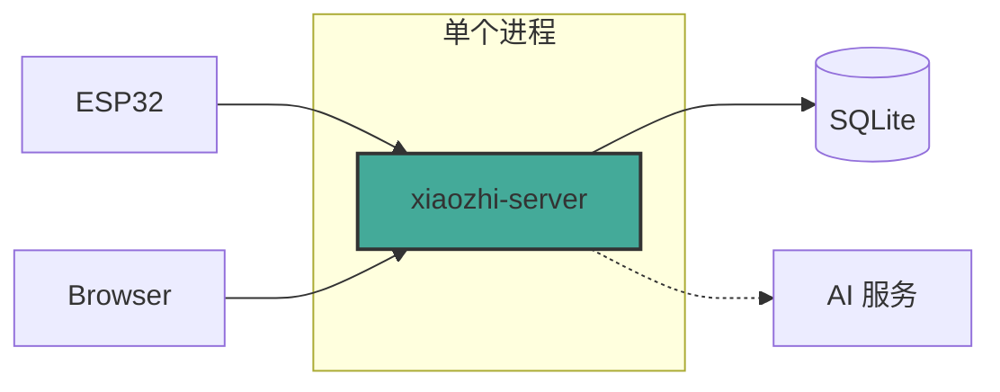
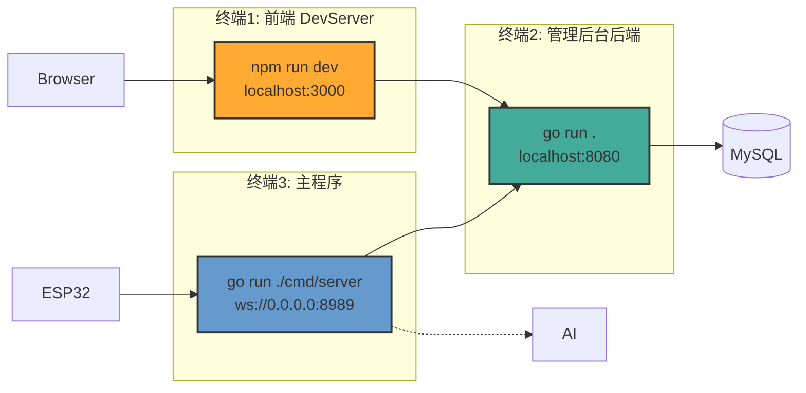
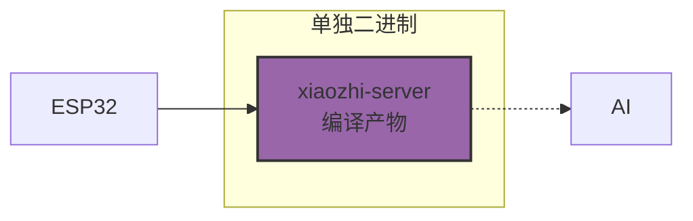
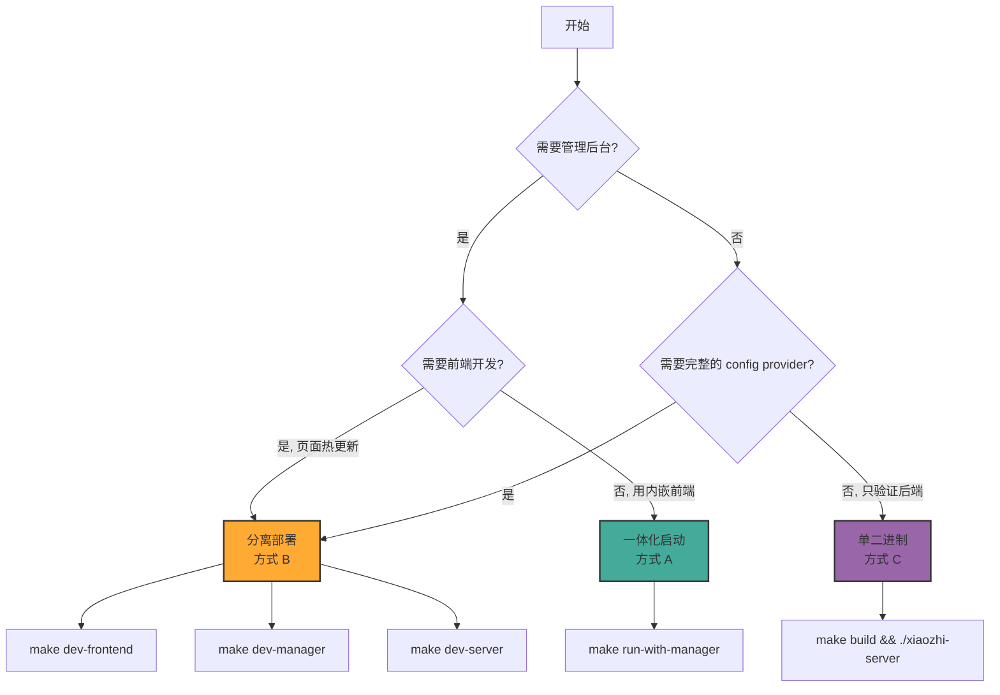
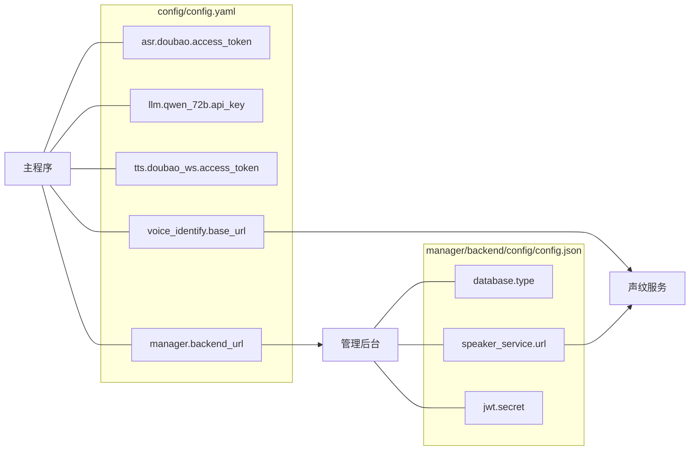

# 系统架构与启动方式全景图

## 一、整体架构：4 个子系统



---

## 二、3 种部署方式

### 方式 A：一体化启动（AIO）— `make run-with-manager`



**命令：** `make run-with-manager`

**特点：**
- 所有服务编进一个二进制文件
- 前端 `dist/` 用 `//go:embed` 内嵌
- 无需 Node.js，无需前端服务器
- 管理后台用 SQLite，无需 MySQL

**文件结构：**

```
xiaozhi-server（单文件）
├── 主程序（WebSocket/MQTT/UDP）
├── 管理后台后端（Gin HTTP）
└── 管理后台前端（Vue 内嵌 dist/）
```

---

### 方式 B：分离部署（推荐开发调试）— `make dev-*`



**命令：** 三个终端分别执行

```bash
终端1: make dev-frontend   # 前端热更新 → http://localhost:3000
终端2: make dev-manager    # 管理后台     → http://localhost:8080
终端3: make dev-server     # 主程序       → ws://localhost:8989
```

**特点：**
- 前端支持热更新（修改代码即时生效）
- 各服务独立日志，方便定位问题
- 可单独重启某个模块

---

### 方式 C：单二进制启动 — `make build && ./xiaozhi-server`



**命令：**
```bash
make build
./xiaozhi-server -c config/config.yaml
```

**特点：**
- 仅主程序，无管理后台
- 依赖配置文件中的 API Key（直接在 config.yaml 配 ASR/LLM/TTS）
- 最轻量级

---

## 三、对比总览

| 特性 | 方式 A (AIO) | 方式 B (分离) | 方式 C (单服务) |
|------|:------------:|:------------:|:--------------:|
| 管理后台 | ✅ 内嵌 | ✅ 独立进程 | ❌ |
| 前端热更新 | ❌ | ✅ | ❌ |
| 依赖 Node.js | ❌ | ✅ | ❌ |
| 依赖 MySQL | ❌ (SQLite) | 可选 | ❌ |
| 调试便利性 | ⭐⭐ | ⭐⭐⭐ | ⭐ |
| 启动复杂度 | 1 个终端 | 3 个终端 | 1 个终端 |
| 推荐场景 | 日常测试 | 前端开发 | 后端验证 |

---

## 四、启动流程选择决策树



---

## 五、配置文件依赖关系



---

## 六、Makefile 命令速查

```
make setup             安装所有依赖（brew + go mod tidy）
make run               启动主程序（无管理后台）
make run-with-manager  一体化启动（推荐日常使用）
make dev-frontend      前端 DevServer（http://localhost:3000）
make dev-manager       管理后台后端（http://localhost:8080）
make dev-server        主程序（独立进程）
make build             编译主程序二进制
make build-aio         编译一体化二进制
make clean             清除编译产物
```

---

## 七、推荐场景

| 你的角色 | 推荐方式 | 理由 |
|---------|---------|------|
| **日常使用** | `make run-with-manager` | 一键启动，含界面 |
| **前端开发** | `make dev-*` 三终端 | 热更新，调试方便 |
| **后端开发** | `make dev-manager` + `make dev-server` | 日志分离，可单独重启 |
| **仅验证服务** | `make build && ./xiaozhi-server` | 最快启动，无多余依赖 |
| **生产部署** | AIO 打包或 Docker | 单文件/容器化部署 |
